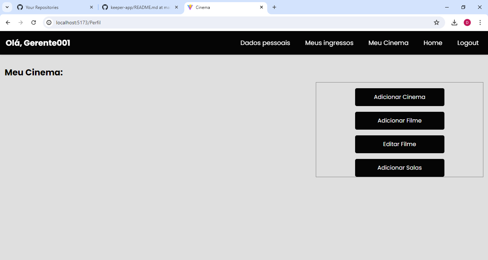

# Projeto Cinema-uepb P7
> Disciplina: Grenciamento de Projetos

> Equipe: Avila Ronny, David Nobrega, Joacir Angelo

# Cinema-uepb

Cinema-uepb is an academic project not linked to UEPB, being an online ticket reservation service. For cinemas registered on the platform, it is also possible for owners to make a registration request to place their cinema on the platform.

# Technologies
- React
- vite
- python
- postgresql

# How to Create a Virtual python Environment with venv
1. Navigate to the Project Directory. Use the cd command to navigate to your project's root directory.
2. Create the Virtual Environment. Use the python -m venv environment_name
3. Activate the Virtual Environment.

# How to run
1. Clone the repository
2. Run `npm install` to install the dependencies
3. Run `pip install -r requirements. txt` to install the dependencies
4. Run `npm run dev` to start the development server
5. Run `python app.py` to start the development server
6. Run `http://localhost:5000/` to populate the database with demo data
7. Open `http://localhost:5173` in your browser

# Live demo
You can see a 5-minute live demo of this project [here](https://www.loom.com/share/c55801bd859d489b8cbe9b9da1e138da)

# Screenshots
> Main page

> Select city and cinema

> See which films are available

> Sign in

> Cinema halls

> Sign up

> Page after login 

> Details filmes

> Make reservation

> Standard user

> My tickets

> Admin

> Admin dash

> Create Cine

> Create Room

> Create filme

